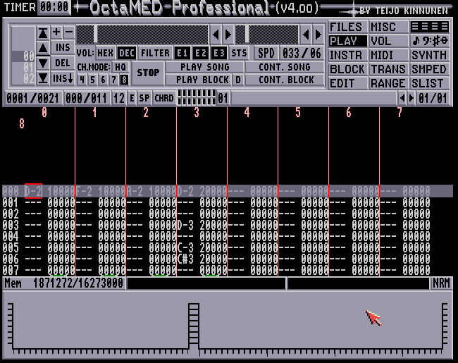

# OctaMEDIC Pro V4 (WIP V0.01 IN DEVELOPMENT)

A faithful clone of OctaMED Professional v4

## Features

- Faithful recreation of the 8 bit sound engine written in Rust using ggez for rendering and cpal for audio playback
- Works with original MMD0, MMD1, and MMD2 modules, configs and samples
- All the original settings, keybinds and plugin support
- Full Midi support
- Original synthesiser and sample editor
- Allows exporting modules back in the original MMD formats for playback on real Amigas/MOD players

## Newly added

- Undo buffer, for fixing accidental deletions
- Extra keybinds for block selection, creation, UI highlighting etc (Full mouseless possibilities)
- Support for importing modern WAV, MP3, FLAC formats (in mono, converted to 8 bit)
- Support for rendering as WAV and MP3
- Automatic Sample folder storage for quick loading samples and modules
- 41-44khz sample rate, which still has the original aliasing simulated
- Cross platform for Windows 10+, Linux and Mac
- Full audio interface support using direct or ASIO style drivers (based on platform)
    - Includes midi in and out for audio interfaces, with both transport and clock sync capabilities
    - Track seperation support for sending up to 8 octamed channels out
    - Record master from Internal audio or from interface IO or both while rendering
- Works in both 1080P HD and the original 640x201 (stretched or windowed) resolutions
- support for original amiga 32 color support and full 32 bit color capabilities

## Documentation

Theres a full manual shipped with the product (also in the /docs folder of the repo)

Additionally, theres a new config setting that allows on hover tooltips in the player itself. These are disabled by default for authenticity.

For questions about the documentation and or the project or bug / authenticity problems please make a github issue.

See [Insert link here](example.com) for a video example of the editors functions

## Installation

To install download a release or an installer from the right hand bar for your platform. (Recommend the installer)

It is also possible to build from source using the rust cargo toolchain. This way you get the newest changes (but also the breaking ones!) immediately.

When using the installer, automatic updates are also added. Whenever you startup OctaMEDIC it will check if there are any new versions available and give you an update prompt.

## In this repo
- octamed
    - parser and structs for original octamed files
- octamed_cli
    - cli tool for reading octamed mmds and extracting wav files
- octamedic_core
    - core library for octamedic, including the playback engine
- octamedic_gui
    - full octamed clone made using ggez
## Roadmap
- [X] Loading real mmd file's metadata, note and instrument data
- [ ] Loading protracker/soundtracker supported modules
- [ ] Loading extra metadata from mmd files
- [ ] Initial engine iteration which can playback real mmd files with just note data (no commands yet)
- [ ] Initial editor iteration that can edit notes and patterns of existing mmd files but cant edit instruments
- [ ] Write back modules to:
    - [ ] MMD0
    - [ ] MMD1 (No Instr)
    - [ ] MMD1 +Instruments
- [ ] Sample Commands
- [ ] Midi commands
- [ ] Synth commands
- [ ] Loading wav files as instruments
- [ ] Loading IFF files
- [ ] Editing instruments
- [ ] Keybind mapping
- [ ] Midi in support
    - [ ] Omni in support
    - [ ] Midi control mapping 
- [ ] Midi mapping
- [ ] Track to audio interface routing support
- [ ] Gui overhaul to make it look like octamed
- [ ] Octamed configuration support
- [ ] Custom configuration overrides
